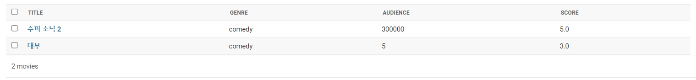
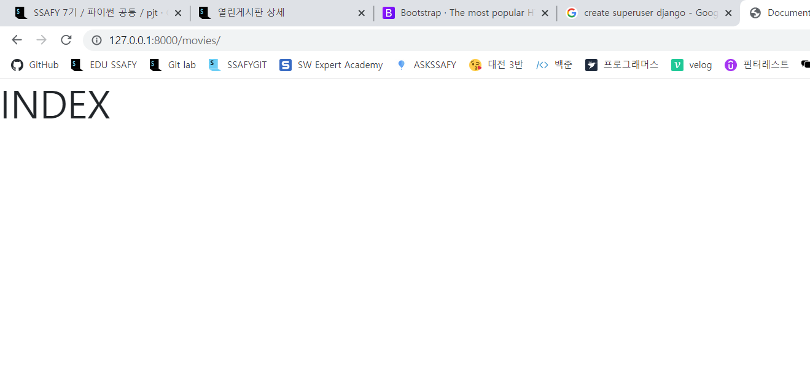
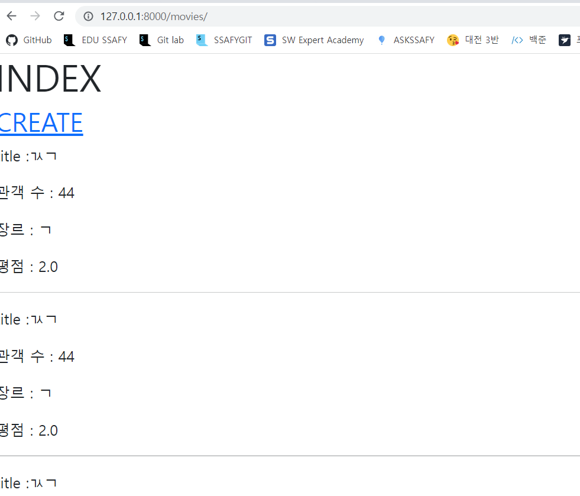
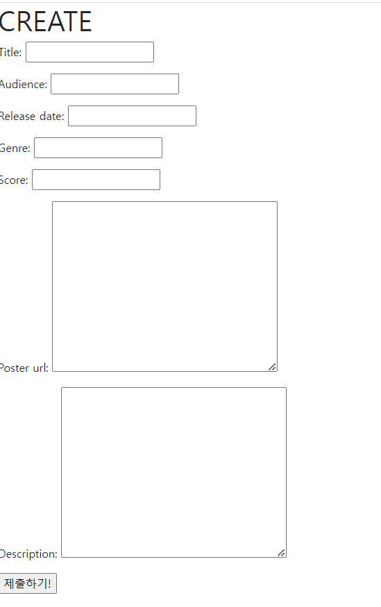
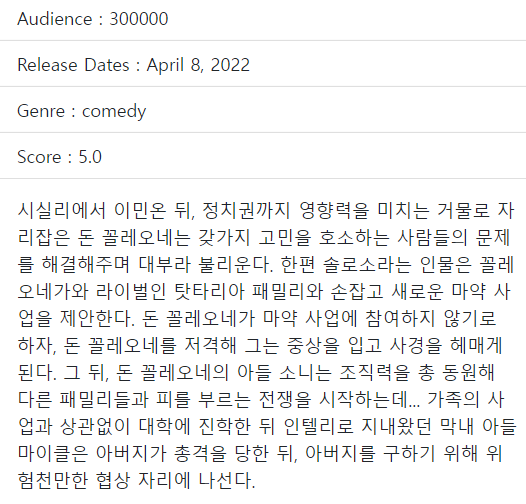
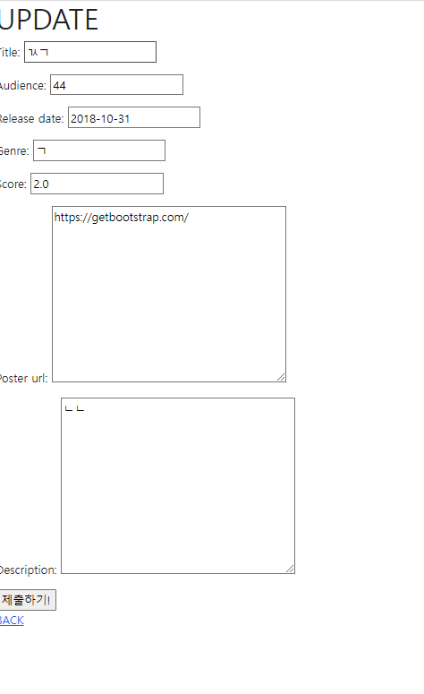
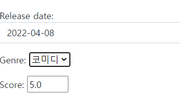
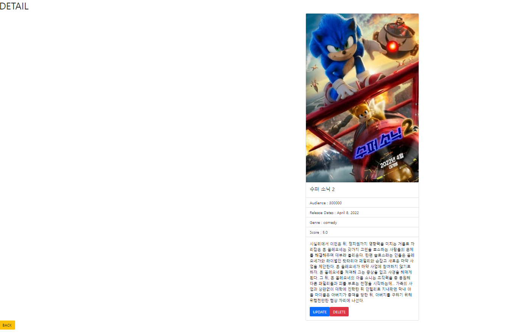
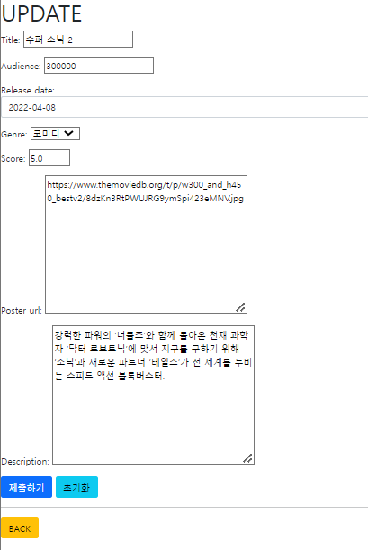
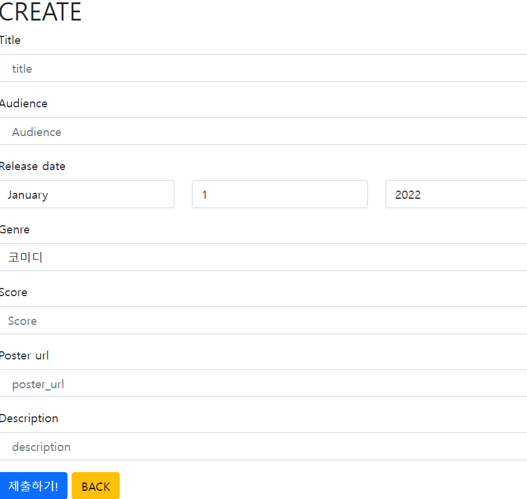

# PTJ 06


<div style="text-align: right"> 대전_3반_김동완</div>

## 이번 ptj를 통해 배운 내용

1. CRUD를 활용한 Web application 제작
1. ORM을 이용한 데이터 활용
1. Django ModelForm을 활용한 사용자 요청 데이터 유효성 검증 


### 개발도구

- Visual Studio Code
- Google Chrome Browser
- Bootstrap v5
- Django 3.2+


### 요구사항 

- 커뮤니티 서비스의 게시판 기능 개발을 위한 단계로, 영화 데이터의 생성, 조회, 수정, 삭제 가능
  한 어플리케이션을 완성합니다. 해당 기능은 향후 커뮤니티 서비스의 필수 기능으로 사용됩니다.
  아래 기술된 사항들은 필수적으로 구현해야 하는 내용입니다.
  Django 프로젝트 이름은 pjt06, 앱 이름은 movies로 지정합니다. 

### 프로젝트 진행

##### 프로젝트는 전반적으로 기능을 구현하며 커밋을 진행했으므로, 커밋 순서에 따라서 진행을 서술하겠습니다.


### 1단계 : 기본 형식 만들기 

#### basic setting 

- 기본적인 장고 세팅을 했습니다.
- 가상환경 설정, gitignore, 프로젝트 생성, 앱 등록, 템플릿 만들기를 진행했습니다. 
- 지난 프로젝트를 시간 안에 하기 힘들어서 급하게 한 탓에 BASE TEMPLAGE의 경로를 프로젝트 내부에 생성해서 추후에 오류가 발생했었습니다.

#### Model 만들기

- MdoelForm을 사용하여야해서 이전보다 빠르게 모델을 먼저 만들었습니다.
- 명세서에서 요구되는대로 데이터 유형에 맞춰서 모델을 만들었으며, 성공적으로 migration했습니다.

```python
class Movie(models.Model) :
    # 영화제목
    title = models.CharField(max_length=20)
    #관객 수  
    audience = models.IntegerField()
    #개봉일
    release_date = models.DateField()
    #장르
    genre = models.CharField(max_length=30)
    #평점
    score = models.FloatField()
    #포스터 경로
    poster_url = models.TextField()
    #줄거리
    description = models.TextField()
```

#### adminpage 만들기

- admin page는 Title, 장르, 관객, 평점을 볼 수 있게 리스트로 view를 구성했고, superuser를 만들어 접근이 가능하게 했습니다.
- 필드가 많아 데이터 넣기가 까다로워 추후 create를 만든 후 확인하기로 했습니다.

```python
class MovieAdmin(admin.ModelAdmin) :
    # admin 페이지에서는 영화 기본 정보 보여주기 
    list_display = ('title','genre','audience','score')

admin.site.register(Movie,MovieAdmin)
```



### 2단계 : CRUD 구축하기 

#### INDEX HTML 만들기

- INDEX HTML과 함수를 만들고 기본 메인페이지에 표시하려 했으나, basehtml을 찾지 못하는 현상이 발생했습니다. 
- 따라서, 문제 해결을 위해 경로를 찾아가본 결과 프로젝트 폴더 내부에 templates 폴더가 있었고, 이를 root폴더 하위로 옮겨 문제를 해결할 수 있었습니다.




#### ModelForm 만들기

- 데이터를 받을 때 Modelform 양식대로 받을 것이기 때문에 먼저 forms.py를 만들어서 modelform을 구성했습니다. 명세서에 추가적인 사항은 추후 세부적으로 구현하기 위해 일단 모든 필드를 다른 widget없이 세팅했습니다.

```python
class MovieForm(forms.ModelFrom) :

    class Meta :
        model = Movie 

        fields = '__all__'
```

#### CREATE 함수 만들기

- 데이터를 본격적으로 받을 준비가 되어, create url과 함수,html을 생성했습니다. 이전에는 new와 create를 따로 만들어서 사용했으나, ModelForm을 이용하고 method를 POST로 구분하여 진행하고자 했습니다.
- CREATE 함수를 만들고 index 페이지에 CREATE링크를 추가했습니다.


### 



- 이 과정에서 CREATE함수에서 제출을 눌러도 index로 redirect가 되지 않는 문제가 발생했습니다. 
  - 오류는 발생하지 않고, method가 POST가 아닐 경우 다시 렌더링 되는 create.html이 보여서, method를 찾아본 결과 method='POST'가 아닌 request='POST'라고 타이핑이 되어있어, 이를 개선하니 문제를 해결할 수 있었습니다.

#### Detail

- 데이터 입력이 문제없이 되는걸 확인하고, Detiail view를 만들기로 했습니다.

- templates에는 일단 영화 제목, 평점, 제목이 표현되게 했고, index 페이지에 각 항목마다 detail로 갈 수있는 링크를 만들었습니다. 

- 이 과정에서 객체를 만들었을 때 index로 redirect 하는 것이 아닌 detail로 redirect하게 변경했는데, 오류가 발생했습니다. 넘겨주는 과정에 pk를 깜빡해서 문제가 발생했고 곧 해결했습니다.

  

#### UPDATE 기능 만들기

- update는 기본적으로 CREATE와 유사하기 때문에, 함수에서는 instance만 넘겨주게 변경하고, html은 form 작성 후 도착하는 경로만 변경하도록 구성했습니다.



#### DELETE 

- 실험용으로 데이터를 많이 만들었고, CRUD 기능 중 마지막 DELETE를 만들었습니다.
- POST로 요청이 올 때 DB에서 데이터를 삭제하고 index로 이동하게 했고 성공했습니다.

- detail html에 추가해줬습니다.

#### 허용 HTTP Method 설정

- 잘못된 접근이 있을 시 보다 명확한 에러를 반환하기 위해 django.shorcuts에 있는 get_objects_or_404를 이용해서 객체에 직접 접근하는 요소들에게 적용해주었습니다.
- 또한 decorator를 사용해서 받을 수 있는 신호들을 제한했습니다.

### 3단계 : 세부 세팅하기

#### Field setting

- 기본적인 CRUD 세팅이 끝났기 때문에, 명세에 기술된 요소들 중 Form에 Field들을 세팅했습니다.
- Form의 세팅과 ModelForm의 세팅이 다를 줄 알았는데, 유사해서 쉽게 해결할 수 있었습니다.

```python
        choices=GENRE_CHOICES,
        widget=forms.Select()
    )

    score = forms.FloatField(
        widget=forms.NumberInput(
            attrs = {
                'min':0,
                'max' :5,
                'step':0.5 
            }
        )
    )
    release_date = forms.DateField(
        input_formats=['%Y-%m-%d'],
        widget=forms.DateInput(attrs={
            'class' : 'form-control dateimepicker-input',
            'data-target': '#datetimepicker1'
        }
        )
    )
```



#### Bootstrap 적용

- 부트스트랩을 설치하고 form과 template에 적용했습니다. 
- 이 과정에서 update를 했을 때, 같은 글이 반복적으로 생기는 문제가 발생했습니다.
  - update를 한 후 POST로 신호를 보내고 pk를 적용해 detail로 넘겨줘야하는데, 그렇지 않아서 그런 것 같습니다.
  - 다행히 해결했습니다.
- 전반적으로 detail.html에 카드 컴포넌트와 마진, button 속성들을 줘서 명세서와 유사하게 구성하고자 노력했습니다.





#### PLACEHOLDER 설정

- 플레이스 홀더를 추가해줬습니다. 


